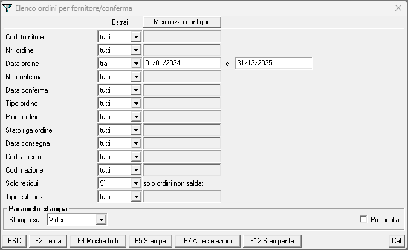
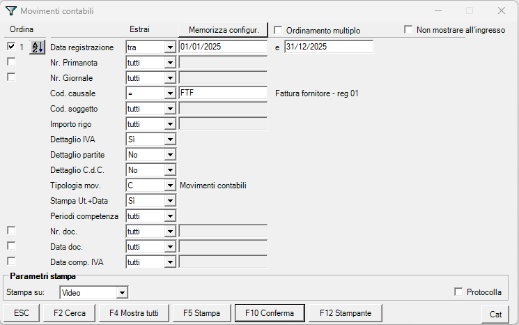
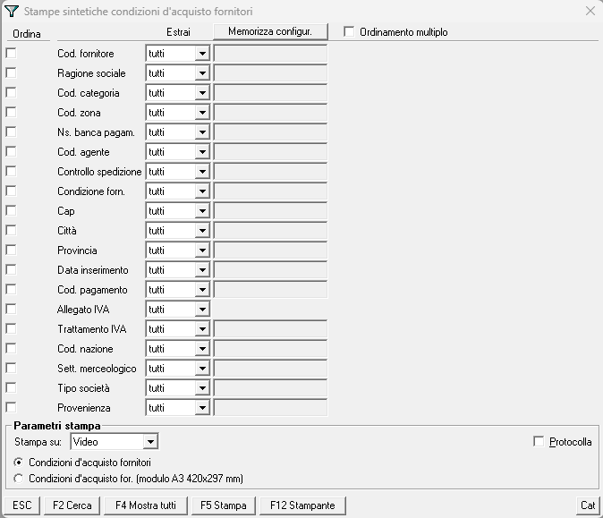

## previsioni_costo_economico

### Descrizione
Questo progetto ha lo scopo di generare un report di previsione dei costi economici basato sugli ordini di acquisto. Estrapola i dati da un file Excel contenente gli ordini fornitori, li aggrega per mese e, opzionalmente, li arricchisce con i dati di contropartita e condizioni di pagamento.

### Script Principale: `generate_report.py`

#### Scopo
Lo script `generate_report.py` è lo strumento unico per la generazione del report. Esegue fino a tre compiti principali:
1.  Legge i dati degli ordini da `ordfor06.xlsx` per creare un report di previsione aggregato per fornitore e mese.
2.  Se rileva la presenza del file `conto.xlsx`, arricchisce il report con la colonna "Contropartita".
3.  Se rileva la presenza del file `condizioni.xlsx`, arricchisce il report con la colonna "Condizioni di Pagamento".

#### Funzionalità principali:
- Estrazione e aggregazione degli ordini per fornitore, mese e anno, con supporto per previsioni multi-anno (attualmente fino al 2026).
- Calcolo dei totali e formattazione in valuta (€) con arrotondamento all'intero.
- **Arricchimento automatico (opzionale)**:
    - Aggiunta della colonna "Contropartita" tramite mappatura da `conto.xlsx`.
    - Aggiunta della colonna "Condizioni di Pagamento" tramite mappatura da `condizioni.xlsx`.
- Gestione dei fusi orari per un timestamp di aggiornamento sempre corretto (fuso orario di Roma).

#### Come utilizzare lo script

**Prerequisiti:**
Assicurati di avere Python e le librerie necessarie installate:
```bash
pip install openpyxl pytz
```

**File di Input:**

**1. `ordfor06.xlsx` (Obbligatorio)**
   - **Percorso di estrazione:** `Ordini fornitori -> Consultazione stampe ordini per soggetto conferma`
   - **Nota:** Il file viene esportato come `ordfor06.xls` e deve essere salvato con estensione `.xlsx`.

   

**2. `conto.xlsx` (Opzionale)**

   - **Data registrazione:** `Chiedere in amministrazione il periodo`
   - **Percorso di estrazione:** `Contabilità ordinaria -> Consultazioni -> Movimenti contabili`
   - **Filtro:** `Cod. causale FTF`

   


**3. `condizioni.xlsx` (Opzionale)**
   - **Percorso di estrazione:** `Anagrafica soggetti -> Stampe -> fornitori -> Condizioni d'acquisto`

   

**Esecuzione:**
Per generare il report, esegui un singolo comando dal terminale:
```bash
python generate_report.py
```
Lo script produrrà il report di base, includendo le previsioni per gli anni 2025 e 2026, e, se trova i file opzionali, lo arricchirà automaticamente.

**File di Output:**
Lo script genera il file `forecasting.xlsx` con le eventuali colonne aggiuntive.

### Applicazione Web: `app.py`

#### Scopo
L'applicazione `app.py` fornisce un'interfaccia web interattiva (basata su Streamlit) per eseguire la stessa logica di `generate_report.py` direttamente dal browser.

#### Funzionalità:
- Caricamento del file `ordfor06.xlsx`.
- **Sezioni opzionali** per caricare:
    - `conto.xlsx` per aggiungere la colonna "Contropartita".
    - `condizioni.xlsx` per aggiungere la colonna "Condizioni di Pagamento".
- Filtro interattivo per i fornitori.
- Visualizzazione del report a schermo con importi in valuta (€) arrotondati all'intero.
- Download del report finale in formato Excel.
- **Titolo aggiornato**: Il titolo dell'applicazione è stato modificato in "📊 Vetronaviglio s.r.l. - Report Previsioni Costo Economico".

#### Come utilizzare l'applicazione

**Prerequisiti:**
```bash
pip install streamlit pandas openpyxl pytz
```

**Esecuzione:**
```bash
streamlit run app.py
```

### Data Ultimo Aggiornamento: 05/11/2025